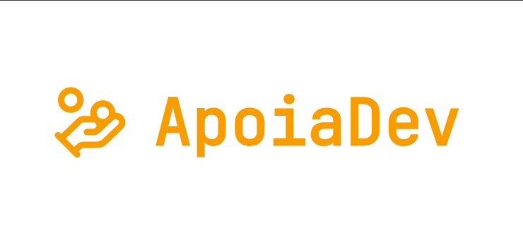

# 🚀 Apoia.dev

Bem-vindo ao **Apoia.dev** — a plataforma moderna para criadores de conteúdo receberem apoio financeiro de forma simples, rápida e estilosa.



## ✨ Sobre

O **Apoia.dev** conecta criadores e apoiadores, facilitando doações e interações em uma experiência personalizada e sem burocracia.

- Página exclusiva para cada criador
- Recebimento de doações em poucos cliques
- Mensagens personalizadas dos apoiadores
- Dashboard intuitivo para gestão de doações

## 🛠️ Tecnologias

- Next.js (App Router)
- TypeScript
- Tailwind CSS
- Prisma ORM
- PostgreSQL
- NextAuth.js
- Sonner (notificações)
- Radix UI

## 🚦 Como rodar localmente

1. **Clone o repositório**

   ```sh
   git clone https://github.com/seu-usuario/apoia-dev.git
   cd apoia-dev
   ```

2. **Instale as dependências**

   ```sh
   npm install
   ```

3. **Configure o ambiente**

   - Copie `.env.example` para `.env` e preencha as variáveis.

4. **Rode as migrations**

   ```sh
   npx prisma migrate dev
   ```

5. **Inicie o projeto**
   ```sh
   npm run dev
   ```

Acesse em [http://localhost:3000](http://localhost:3000)

## 🧑‍💻 Contribua

Contribuições são bem-vindas! Abra uma issue ou envie um PR.

## 📄 Licença

MIT

---

Feito com muito ☕ por [Seu Nome](https://github.com/eduardobertozi)
